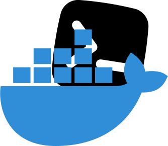

<p style="display: flex; justify-content: center"></p>
___

`## [Docker CommandLine](https://docs.docker.com/engine/reference/commandline/cli/)`

#### Download 1 image từ [Docker Hub](https://hub.docker.com/)

```shell
# https://hub.docker.com/_/nginx
docker pull nginx:1.23.3
docker pull michaelirwin244/wasm-example
```

#### [Hiển thị danh sách Images](https://docs.docker.com/engine/reference/commandline/images/)

```shell
docker images --all #--quiet
```

#### [Hiển thị thông tin low-level của Image|Container](https://docs.docker.com/engine/reference/commandline/inspect/) như: `"Architecture": "wasm32"`, `Env`,`Size`...

```shell
docker inspect nginx > inspect.json; code inspect.json; rm inspect.json
```

#### [Tạo và chạy vùng chứa mới từ một hình ảnh](https://docs.docker.com/engine/reference/commandline/run/)

*Lưu ý volume dùng để gắn kết các folder chứ không phải tập tin* <br>
*[--mount sẽ có cú pháp dài dòng hơn --volume](https://docs.docker.com/storage/bind-mounts/)*

```shell
docker run -d -p 8080:80 --name www -v D:\Source\docker\command\html:/var/www/html -v D:\Source\docker\command\logs:/var/log/nginx -v D:\Source\docker\command\conf.d:/etc/nginx/conf.d nginx

docker inspect www > inspect.json; code inspect.json; rm inspect.json #PortBindings 8080
```

[Danh sách Container](https://docs.docker.com/engine/reference/commandline/ps/)

```shell
docker ps --all
```

#### [Thực thi (Execute) command trong Container](https://docs.docker.com/engine/reference/commandline/exec/)

```shell
# Đối với phiên bản như alpine hoặc slim thường không có Bash, có thể thay thế băng Sh
docker exec -it -u root www bash

```

#### [Copy file/folder giữa Container và Local/VPS](https://docs.docker.com/engine/reference/commandline/cp/)

```shell
docker cp ./html/post.html www:/var/www/html
```

#### [Hiển thị Logs của Container](https://docs.docker.com/engine/reference/commandline/logs/)

```shell
docker logs --details --follow --timestamps --tail 5 --since 2023-03-13T03:56:33.542039610Z --until 2024-01-01T23:59:59Z www
```

## Các lệnh khác

```shell
docker login
docker logout
docker tag
docker commit
docker push
docker network
docker kill
docker rm
docker rmi
```

## Clear Container, images, volume, config in Docker

```shell
docker kill $(docker ps -aq)
docker rm $(docker ps -aq)
docker rmi $(docker images -aq)
docker volume prune -f
docker system prune --all --force
```